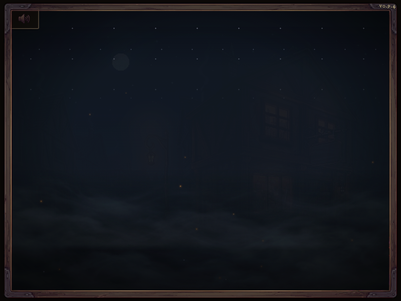
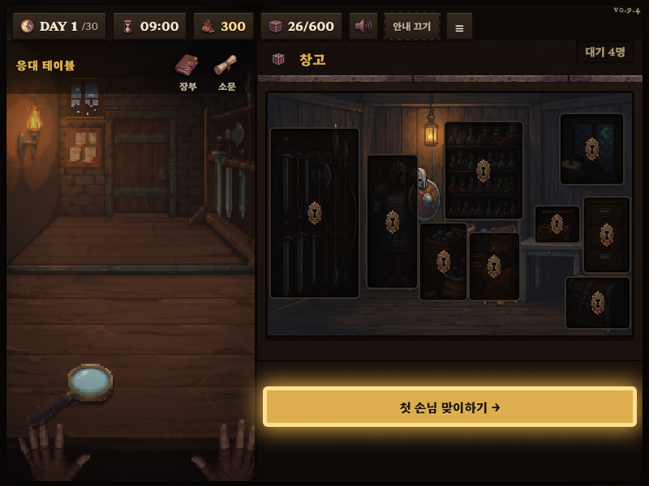
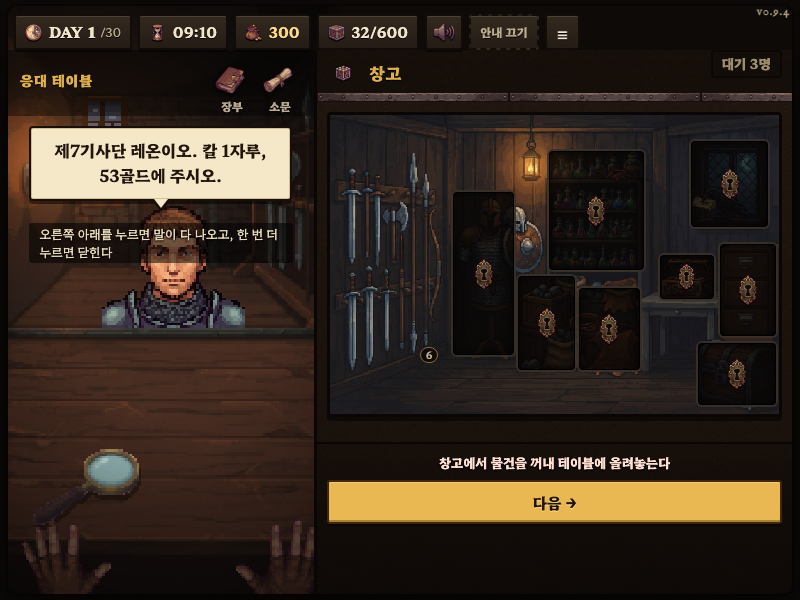
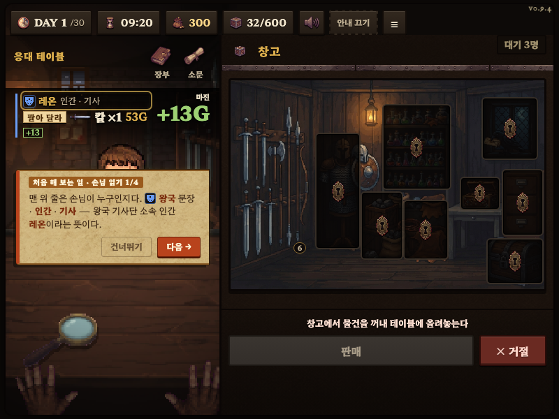

# Next! — 무기상의 장부

판타지 도시 한 켠, 작은 무기점을 맡아 30일을 운영하는 브라우저 게임입니다. 손님을 맞고, 물건을 팔고, 장부를 채워 가는 게 전부처럼 보이지만 꼭 그렇지만도 않습니다.



## 플레이

https://41ways.github.io/armsdealer/

설치도 빌드도 필요 없습니다. 링크만 열면 바로 시작합니다.

## 어떤 게임인가

매일 손님이 찾아옵니다. 이름과 소속, 하려는 말을 듣고 창고에서 물건을 꺼내 값을 매겨 파는 것이 기본 흐름입니다.



손님마다 사정이 다릅니다. 급하게 물건을 찾는 사람, 대뜸 값을 깎는 사람, 물건은 안 사고 말만 걸고 가는 사람도 있습니다. 인장을 돋보기로 들여다보면 소속과 최근 사정을 짐작할 수 있고, 그중엔 진짜가 아닌 것도 섞여 있습니다.



거래마다 장부에 한 줄씩 남습니다. 신문과 소문은 그날그날의 세상 돌아가는 이야기를 전해 주는데, 가끔 낯익은 이름이 등장하기도 합니다.

## 진행

첫 며칠은 안내 카드가 붙어서 화면을 하나씩 짚어 줍니다. 창고, 인장, 장부, 신문 순서로 손에 익으면 그다음부터는 스스로 판단해서 팔아야 합니다.



상점에는 창고 확장, 정보원, 경비 고용 같은 업그레이드가 있어서 플레이 스타일에 따라 다르게 키울 수 있습니다.

## 기술

빌드 도구 없는 정적 페이지입니다. HTML, CSS, 바닐라 자바스크립트로 되어 있고 Canvas와 DOM을 같이 씁니다. 진행 상황은 브라우저 `localStorage`에 저장되며 슬롯은 3개입니다.

```
armsdealer/
├── index.html
├── assets/
├── css/
├── js/
│   ├── core/      부트/유틸
│   ├── data/      아이템·손님·사건 등 콘텐츠
│   ├── systems/   규칙과 상태 변화
│   ├── render/    화면 표시
│   └── ui/        조작 화면
├── tools/         시뮬레이터·로컬 서버
└── docs/          개발 인수인계 문서
```

로컬 실행:

```bash
python3 tools/serve.py 8765
```

밸런스는 헤드리스 시뮬레이터로 잡습니다.

```bash
node tools/sim.js 200 --policy=beginner|intermediate|expert
```

개발 관련 세부 문서는 `docs/HANDOVER.md`, `docs/BALANCE_HANDOVER.md`에 있습니다. 에셋 출처는 `CREDITS.md` 참고.

## License

`CREDITS.md`에 에셋 출처와 라이선스를 정리해 두었습니다.

---

<details>
<summary>더 알아보기 (스포일러 있음)</summary>

무엇을 누구에게 팔았는지는 단순한 매출 기록으로 끝나지 않습니다. 과거의 거래가 시간이 지나 사건으로, 그리고 세력 사이의 관계로 돌아옵니다. 왕국과 고블린, 드워프를 비롯해 게임을 진행하며 조금씩 드러나는 세력들이 서로 얽혀 있고, 한쪽의 사정이 다른 쪽에 영향을 미칩니다.

이야기가 여럿 겹치는 후반부에는 손님을 통해 정치적인 선택을 요구받기도 합니다. 무엇을 팔 것인지 결정하는 게 곧 어느 편에 설 것인지를 정하는 셈이 됩니다. 30일이 지나면 그동안 쌓인 장부를 바탕으로 결말이 갈리며, 결말은 30가지에 가깝게 준비되어 있습니다.

</details>
